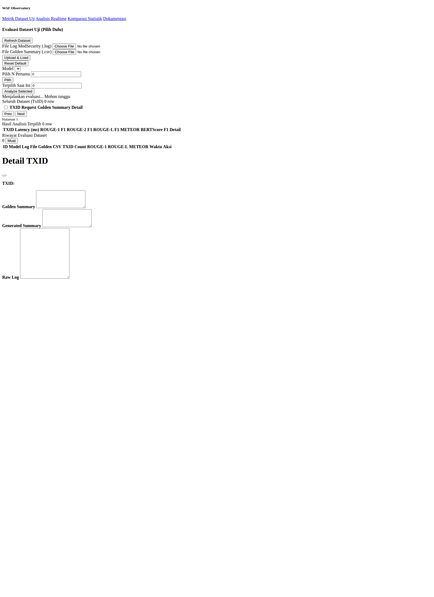
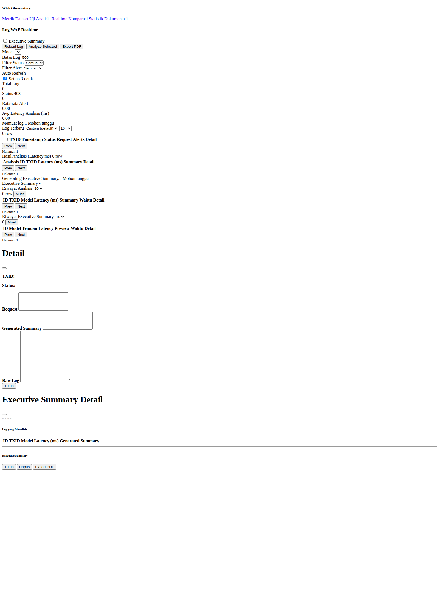
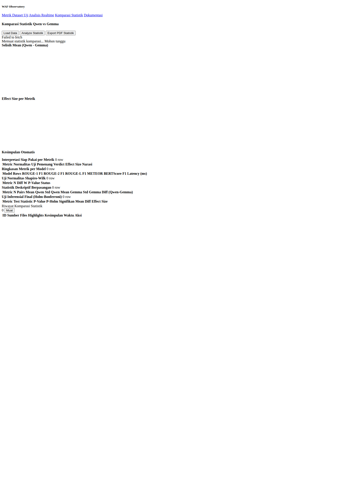
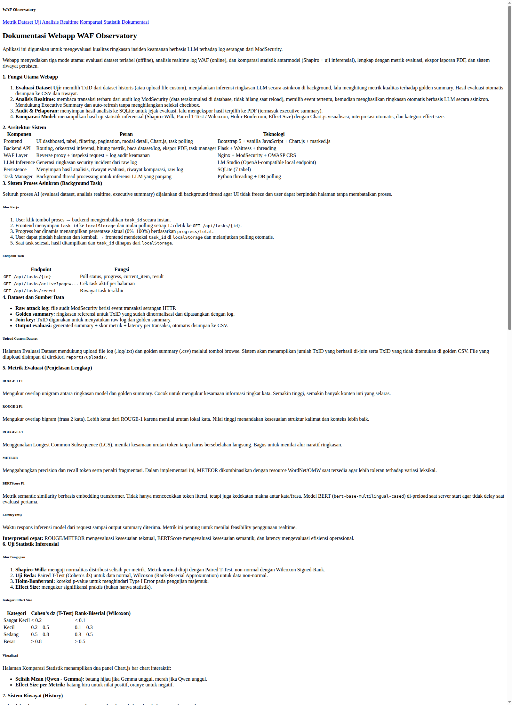

# WAF Observatory App

WAF Observatory App adalah aplikasi observabilitas keamanan web berbasis **Nginx + ModSecurity + OWASP CRS + Flask + LM Studio** untuk:

1. **Evaluasi kualitas ringkasan insiden keamanan** dari dataset berlabel (golden summary).
2. **Analisis log WAF realtime** dari audit log ModSecurity.
3. **Komparasi statistik antarmodel LLM** (Qwen vs Gemma) dengan uji inferensial.
4. **Pelaporan PDF** untuk analisis teknis dan executive summary.

Aplikasi ini ditujukan untuk membantu SOC analyst, engineer, dan peneliti mengubah raw log WAF yang teknis menjadi insight yang lebih cepat dipahami.

---

## Daftar Isi

- [WAF Observatory App](#waf-observatory-app)
  - [Daftar Isi](#daftar-isi)
  - [Mengapa Proyek Ini Penting](#mengapa-proyek-ini-penting)
  - [Fungsi Utama](#fungsi-utama)
  - [Keunggulan Utama](#keunggulan-utama)
  - [Arsitektur Sistem](#arsitektur-sistem)
  - [Alur Data End-to-End](#alur-data-end-to-end)
  - [Struktur Repository](#struktur-repository)
  - [Teknologi yang Digunakan](#teknologi-yang-digunakan)
  - [Konfigurasi Lingkungan (Environment Variables)](#konfigurasi-lingkungan-environment-variables)
  - [Instalasi dan Setup](#instalasi-dan-setup)
  - [Panduan Penggunaan dari Nol (Step-by-Step Lengkap)](#panduan-penggunaan-dari-nol-step-by-step-lengkap)
  - [Galeri Screenshot Tahapan](#galeri-screenshot-tahapan)
  - [Menjalankan Aplikasi](#menjalankan-aplikasi)
  - [Halaman dan Kapabilitas Frontend](#halaman-dan-kapabilitas-frontend)
  - [API Backend Lengkap](#api-backend-lengkap)
  - [Struktur Database SQLite](#struktur-database-sqlite)
  - [Mekanisme Background Task](#mekanisme-background-task)
  - [Evaluasi Metrik NLP](#evaluasi-metrik-nlp)
  - [Komparasi Statistik Qwen vs Gemma](#komparasi-statistik-qwen-vs-gemma)
  - [Ekspor Laporan PDF](#ekspor-laporan-pdf)
  - [Integrasi Infrastruktur (Nginx, ModSecurity, systemd)](#integrasi-infrastruktur-nginx-modsecurity-systemd)
  - [Dataset dan Format Data](#dataset-dan-format-data)
  - [Script Utilitas dan Seed Serangan](#script-utilitas-dan-seed-serangan)
  - [Manfaat Penggunaan](#manfaat-penggunaan)
  - [Batasan yang Perlu Diketahui](#batasan-yang-perlu-diketahui)
  - [Troubleshooting](#troubleshooting)

---

## Mengapa Proyek Ini Penting

Dalam operasi keamanan nyata, log WAF sangat besar dan sulit dibaca cepat. Proyek ini mengisi gap antara:

- **Deteksi rule-based** (ModSecurity + CRS) yang akurat,
- dan **pemahaman naratif** (LLM) yang lebih mudah dipakai untuk triage, audit, dan pelaporan.

Hasilnya: tim bisa lebih cepat memahami pola serangan, bukan hanya melihat status blokir.

---

## Fungsi Utama

1. **Dataset Evaluation (offline/terlabel)**
   - Join raw log + golden summary berdasarkan `tx_id`.
   - Jalankan ringkasan LLM per transaksi.
   - Hitung metrik: ROUGE-1/2/L, METEOR, BERTScore F1, dan latency.
   - Simpan hasil ke DB + CSV.

2. **Realtime Analysis (online/tanpa ground truth)**
   - Baca transaksi terbaru dari `/var/log/modsecurity/audit.log`.
   - Pilih baris log tertentu, ringkas dengan model LLM.
   - Simpan riwayat analisis dan hasil executive summary.

3. **Statistical Comparison**
   - Baca CSV hasil evaluasi model.
   - Tampilkan ringkasan statistik deskriptif, normalitas, inferensial, effect size.
   - Generate highlight dan kesimpulan otomatis.

4. **Reporting**
   - Export PDF untuk analisis per transaksi, kumpulan analisis + executive summary, dan komparasi statistik.

---

## Keunggulan Utama

- **End-to-end**: dari log mentah WAF sampai laporan PDF siap dibagikan.
- **Asinkron non-blocking**: tugas berat berjalan di background thread dengan progress tracking.
- **Persisten**: riwayat analisis, evaluasi, komparasi, dan raw logs tersimpan di SQLite.
- **Model-aware**: mendukung seleksi model LLM dan komparasi ilmiah antar model.
- **Praktis untuk SOC**: ada executive summary dalam Bahasa Indonesia formal.

---

## Arsitektur Sistem

| Komponen | Peran |
|---|---|
| Nginx | Reverse proxy untuk webapp dan API backend |
| ModSecurity + OWASP CRS | Inspection engine WAF, deteksi/memblokir request berbahaya |
| Flask Backend | API utama, orkestrasi inferensi, metrik, DB, ekspor PDF |
| LM Studio | Endpoint inference OpenAI-compatible (`/v1/models`, `/v1/chat/completions`) |
| SQLite | Penyimpanan history analisis, evaluasi, task, komparasi, raw logs |
| Frontend (Bootstrap + JS) | Dashboard interaktif untuk dataset, realtime, komparasi, dokumentasi |

---

## Alur Data End-to-End

1. Request masuk ke **Nginx + ModSecurity**.
2. Request dipindai rule OWASP CRS, event dicatat ke audit log.
3. Backend membaca log (dataset/realtime) dan membangun prompt.
4. Backend memanggil LM Studio untuk menghasilkan summary.
5. Untuk mode dataset: backend menghitung metrik kualitas teks.
6. Hasil disimpan ke SQLite + opsional diekspor ke CSV/PDF.
7. Frontend polling status task hingga selesai dan menampilkan hasil.

---

## Struktur Repository

```text
waf-observatory-app/
├── backend/
│   ├── app.py
│   ├── config.py
│   ├── requirements.txt
│   ├── requirements-metrics-full.txt
│   ├── services/
│   └── templates/
├── infra/
│   ├── modsecurity/main.conf
│   ├── nginx/waf_observatory.conf
│   └── systemd/waf-observatory-backend.service
├── scripts/
├── docs/
├── SEED_WAF_LOGS.sh
└── POC_*.txt
```

---

## Teknologi yang Digunakan

### Backend Python
- Flask 3.0.3
- python-dotenv
- requests
- rouge-score
- nltk
- reportlab
- waitress
- scipy
- opsional: bert-score (di `requirements-metrics-full.txt`)

### Frontend
- Bootstrap 5
- Vanilla JavaScript
- Chart.js (halaman komparasi)
- marked.js (render markdown executive summary)

### Infra
- Nginx
- ModSecurity + OWASP CRS
- systemd

---

## Konfigurasi Lingkungan (Environment Variables)

Sumber default ada di `backend/config.py`.

| Variable | Default | Fungsi |
|---|---|---|
| `DATASET_LOG_PATH` | `WORKSPACE_ROOT/DATASET/owasp/01-Aug-2025/modsec_audit.anon.log` | Sumber raw log dataset |
| `DATASET_GOLDEN_CSV_PATH` | `WORKSPACE_ROOT/DATASET1000_with_summary.csv` | Sumber golden summary |
| `LM_STUDIO_BASE_URL` | `http://127.0.0.1:1234` | Endpoint LM Studio |
| `MODSEC_AUDIT_LOG_PATH` | `/var/log/modsecurity/audit.log` | Sumber realtime audit log |
| `SQLITE_PATH` | `backend/instance/app.db` | Lokasi DB SQLite |
| `REPORTS_DIR` | `backend/reports` | Output PDF/CSV/upload |
| `COMPARE_RESULTS_DIR` | `WORKSPACE_ROOT/HASIL/lmstudio_top1000_eval` | Direktori CSV komparasi |

> Prompt summary dibatasi `MAX_RAW_CHARS = 4000`, log yang lebih panjang dipotong dengan suffix `... [dipotong]`.

---

## Instalasi dan Setup

### 1) Setup Python backend

```bash
cd backend
python3 -m venv .venv-wsl
source .venv-wsl/bin/activate
pip install -r requirements.txt
```

Jika ingin BERTScore penuh:

```bash
pip install -r requirements-metrics-full.txt
```

### 2) Setup infrastruktur WAF (WSL/Linux)

Gunakan script otomatis:

```bash
cd /path/ke/waf-observatory-app
bash scripts/wsl_system_setup.sh
```

Script ini melakukan:
- install nginx + modsecurity,
- copy config ModSecurity dan Nginx,
- enable/restart service nginx,
- install + enable service `waf-observatory-backend`.

> Catatan: file systemd saat ini berisi path dan user spesifik (`risqu`), sesuaikan dengan lingkungan Anda.

---

## Panduan Penggunaan dari Nol (Step-by-Step Lengkap)

Bagian ini adalah alur praktis dari **mesin kosong** sampai **berhasil memakai semua fitur utama aplikasi**.

### A. Persiapan awal sistem

1. Siapkan Linux/WSL2 Ubuntu dengan akses `sudo`.
2. Pastikan internet tersedia untuk instal dependency Python dan paket sistem.
3. Clone repository:

```bash
git clone https://github.com/urtir/waf-observatory-app.git
cd waf-observatory-app
```

4. (Opsional tapi disarankan) update package index:

```bash
sudo apt-get update
```

### B. Siapkan backend Python

1. Masuk ke folder backend:

```bash
cd backend
```

2. Buat virtual environment dan aktifkan:

```bash
python3 -m venv .venv-wsl
source .venv-wsl/bin/activate
```

3. Install dependency minimal:

```bash
pip install -r requirements.txt
```

4. Jika ingin evaluasi BERTScore penuh:

```bash
pip install -r requirements-metrics-full.txt
```

5. Kembali ke root project:

```bash
cd ..
```

### C. Siapkan LM Studio (wajib untuk inferensi)

1. Jalankan LM Studio di host Anda.
2. Aktifkan mode API server OpenAI-compatible.
3. Pastikan endpoint dapat diakses dari backend (default `http://127.0.0.1:1234`).
4. Load model yang didukung aplikasi:
   - `google/gemma-3-4b`
   - `qwen/qwen3-4b-2507`

> Tanpa LM Studio aktif, endpoint model dan proses ringkasan tidak akan berjalan.

### D. Siapkan infrastruktur WAF (Nginx + ModSecurity)

1. Jalankan script setup:

```bash
bash scripts/wsl_system_setup.sh
```

2. Verifikasi service:

```bash
sudo systemctl status nginx --no-pager
sudo systemctl status waf-observatory-backend --no-pager
```

3. Verifikasi konfigurasi Nginx:

```bash
sudo nginx -t
```

### E. Jalankan aplikasi (opsi manual)

Jika tidak memakai systemd, jalankan backend manual:

```bash
cd scripts
bash run_backend_waitress.sh
```

Lalu buka:
- `http://localhost/` (via Nginx), atau
- `http://127.0.0.1:5000/` (langsung ke Flask jika Nginx tidak dipakai).

### F. Verifikasi endpoint dasar

1. Health check:

```bash
curl http://127.0.0.1:5000/api/health
```

2. Cek model tersedia:

```bash
curl http://127.0.0.1:5000/api/models
```

Jika endpoint model kosong/error, periksa kembali LM Studio.

### G. Penggunaan fitur utama (workflow harian)

#### 1) Evaluasi Dataset Uji (`/`)

1. Buka halaman Home.
2. (Opsional) Upload file log + golden CSV custom.
3. Klik **Refresh Dataset**.
4. Pilih model.
5. Pilih TxID (manual/Select First N).
6. Klik **Analyze Selected**.
7. Tunggu progress bar selesai.
8. Tinjau metrik dan hasil detail.
9. Download CSV evaluasi jika diperlukan.

#### 2) Analisis Realtime (`/realtime`)

1. Klik **Reload Log** untuk tarik log terbaru dari ModSecurity.
2. Gunakan filter status/alert/time window.
3. Pilih row log via checkbox.
4. Klik **Analyze Selected**.
5. (Opsional) aktifkan toggle **Executive Summary**.
6. Export PDF jika dibutuhkan.

#### 3) Komparasi Statistik (`/compare`)

1. Pastikan file CSV komparasi tersedia di `COMPARE_RESULTS_DIR`.
2. Klik **Load Data** untuk memuat tabel statistik.
3. Klik **Analyze Statistik** untuk recompute inferensial.
4. Tinjau highlight, chart, kesimpulan, dan interpretasi.
5. Klik **Export PDF Statistik** untuk laporan final.

### H. Simulasi trafik serangan untuk mengisi log realtime

Untuk menghasilkan log uji secara cepat:

```bash
bash SEED_WAF_LOGS.sh
```

Atau gunakan:
- `scripts/seed_owasp_top10_attacks.sh`
- `scripts/seed_owasp_top10_attacks.bat` (Windows)
- `POC_OWASP_WAF_TESTS_WSL*.txt`

Lalu kembali ke halaman `/realtime` dan klik **Reload Log**.

### I. Validasi hasil akhir penggunaan

Checklist sukses:

- `GET /api/health` mengembalikan `{"status":"ok"}`.
- Model Gemma/Qwen tampil di dropdown.
- Dataset bisa dipilih dan dianalisis.
- Realtime log muncul dan bisa diringkas.
- Executive summary berhasil dibuat.
- PDF dan CSV bisa diunduh.
- Riwayat analisis/evaluasi/komparasi tersimpan.

---

## Galeri Screenshot Tahapan

> Screenshot di bawah diambil dari UI aplikasi untuk membantu orientasi penggunaan.

### 1) Homepage - Evaluasi Dataset



### 2) Halaman Realtime Logs



### 3) Halaman Komparasi Statistik



### 4) Halaman Dokumentasi Internal



---

## Menjalankan Aplikasi

### Opsi A: Manual (Waitress)

```bash
cd scripts
bash run_backend_waitress.sh
```

### Opsi B: Flask dev mode

```bash
cd backend
python app.py
```

Akses UI:
- Jika via Nginx: `http://localhost/`
- Jika langsung Flask: `http://127.0.0.1:5000/`

Health check:

```bash
curl http://127.0.0.1:5000/api/health
```

---

## Halaman dan Kapabilitas Frontend

1. **`/` (Dataset Metrics)**
   - Upload dataset custom (log + CSV).
   - Pilih TxID dan jalankan evaluasi.
   - Lihat metrik agregat + detail per TxID.
   - Download CSV hasil evaluasi.
   - Riwayat evaluasi dataset.

2. **`/realtime` (Realtime Logs)**
   - Reload log realtime dari audit log ModSecurity.
   - Filter status/alert/rentang waktu.
   - Analyze selected logs.
   - Opsi Executive Summary.
   - Riwayat analisis dan riwayat executive summary.
   - Export PDF.

3. **`/compare` (Statistical Comparison)**
   - Load data komparasi dari CSV.
   - Analyze statistik (recompute via script eksternal).
   - Visualisasi chart + highlight + tabel inferensial.
   - Export PDF statistik.
   - Riwayat komparasi statistik.

4. **`/docs` (Dokumentasi UI)**
   - Dokumentasi operasional terintegrasi di aplikasi.

---

## API Backend Lengkap

### Health & model
- `GET /api/health`
- `GET /api/models`

### Dataset
- `GET /api/dataset/info`
- `GET /api/dataset/source`
- `POST /api/dataset/configure`
- `POST /api/dataset/reset`
- `GET /api/dataset/rows`
- `GET /api/dataset/tx/<tx_id>`
- `POST /api/evaluate/dataset`
- `POST /api/evaluate/dataset-selected`
- `GET /api/evaluate/download-csv`

### Realtime
- `GET /api/logs/realtime`
- `POST /api/analyze/realtime`
- `POST /api/analyze/executive-summary`

### Task
- `GET /api/tasks/<task_id>`
- `GET /api/tasks/active`
- `GET /api/tasks/recent`

### History
- `GET /api/history/analyses`
- `POST /api/history/analyses/<analysis_id>/delete`
- `GET /api/history/analyses/<analysis_id>/pdf`
- `GET /api/history/executive-summaries`
- `GET /api/history/executive-summaries/<summary_id>`
- `POST /api/history/executive-summaries/<summary_id>/delete`
- `GET /api/history/executive-summaries/<summary_id>/pdf`
- `GET /api/history/dataset-evaluations`
- `POST /api/history/dataset-evaluations/<eval_id>/delete`
- `GET /api/history/stat-comparisons`
- `POST /api/history/stat-comparisons/<comp_id>/delete`

### Reporting & compare
- `POST /api/reports/pdf`
- `POST /api/prompt/preview`
- `GET /api/compare/all`
- `POST /api/compare/report-pdf`
- `POST /api/compare/recompute`

---

## Struktur Database SQLite

Dibuat otomatis oleh `init_db()` di startup.

| Tabel | Isi |
|---|---|
| `analyses` | Hasil analisis per transaksi (dataset/realtime), metrik, latency |
| `executive_summaries` | Ringkasan eksekutif + relasi `analysis_ids` |
| `raw_logs` | Cache transaksi realtime dari audit log |
| `dataset_evaluations` | Riwayat batch evaluasi dataset + path CSV |
| `stat_comparisons` | Riwayat hasil komparasi statistik |
| `tasks` | Tracking task asinkron (`pending/running/done/error`) |

Timezone lokal DB ditetapkan ke `+07:00`.

---

## Mekanisme Background Task

Task panjang dijalankan via thread (`services/task_manager.py`) agar UI tidak freeze.

Flow:
1. Endpoint submit task -> dapat `task_id`.
2. Worker update progress berkala (`progress`, `current_item`).
3. Frontend polling `/api/tasks/<task_id>` per 1.5 detik.
4. Saat selesai, result disimpan JSON di DB dan dibaca UI.

Task type utama:
- `dataset_eval`
- `realtime_analyze`
- `exec_summary`

---

## Evaluasi Metrik NLP

Implementasi di `services/metrics.py`.

- **ROUGE-1 F1**
- **ROUGE-2 F1**
- **ROUGE-L F1**
- **METEOR** (fallback saat WordNet tidak tersedia)
- **BERTScore F1** (jika dependency tersedia)
- **Latency** inferensi (ms)

Ringkasan agregat dihitung dengan rata-rata per metrik non-null.

---

## Komparasi Statistik Qwen vs Gemma

Fitur komparasi membaca file CSV di `COMPARE_RESULTS_DIR`:

- `descriptive_stats.csv`
- `shapiro_results.csv`
- `inferential_results.csv`
- `metrics_summary.csv`

Output UI dan API:
- highlight per metrik (winner, signifikansi, p-holm, effect size),
- quick conclusions otomatis,
- interpretasi naratif siap pakai.

`POST /api/compare/recompute` akan menjalankan script eksternal `run_inferential_tests.py` (wajib tersedia di root workspace).

---

## Ekspor Laporan PDF

Implementasi di `services/pdf_export.py`.

Jenis laporan:
1. Kumpulan analisis realtime/dataset (`/api/reports/pdf`)
2. Detail single analysis (`/api/history/analyses/<id>/pdf`)
3. Executive summary + analisis terkait (`/api/history/executive-summaries/<id>/pdf`)
4. Komparasi statistik (`/api/compare/report-pdf`)

PDF berisi metadata, raw log, generated summary, golden summary (jika ada), dan struktur tabel statistik.

---

## Integrasi Infrastruktur (Nginx, ModSecurity, systemd)

### Nginx (`infra/nginx/waf_observatory.conf`)
- Reverse proxy ke backend `127.0.0.1:5000`.
- Path tertentu (`/api/analyze/realtime`, `/api/analyze/executive-summary`, `/api/prompt/preview`) mematikan ModSecurity untuk mencegah self-blocking payload AI.
- Timeout lebih panjang untuk endpoint inferensi berat.

### ModSecurity (`infra/modsecurity/main.conf`)
- `SecRuleEngine On`
- Audit log serial di `/var/log/modsecurity/audit.log`
- Include OWASP CRS setup + rules.

### systemd (`infra/systemd/waf-observatory-backend.service`)
- Menjalankan script `scripts/run_backend_waitress.sh`
- Auto restart service.

---

## Dataset dan Format Data

### Raw log dataset
- Diparse berbasis boundary transaksi ModSecurity (`--<txid>-A--`).

### Golden CSV
- Kolom TXID fleksibel: `tx_id`, `TXID`, `txid`, `TxID`
- Kolom summary fleksibel: `golden_summary`, `Ringkasan`, `ringkasan`, `summary`, `Summary`

Join dilakukan menggunakan `tx_id`; transaksi tanpa pasangan golden akan ditandai sebagai missing pada mode custom dataset.

---

## Script Utilitas dan Seed Serangan

- `scripts/wsl_system_setup.sh`: setup infra WSL end-to-end.
- `scripts/run_backend_waitress.sh`: jalankan backend production-like.
- `SEED_WAF_LOGS.sh`: generator trafik serangan masif untuk memicu log WAF.
- `scripts/seed_owasp_top10_attacks.sh` dan `.bat`: seed payload OWASP Top 10.
- `POC_OWASP_WAF_TESTS_WSL*.txt`: kumpulan command POC attack untuk validasi WAF.

> Semua script ditujukan untuk lingkungan internal/lab Anda sendiri.

---

## Manfaat Penggunaan

1. **Percepatan investigasi insiden**: raw log teknis menjadi ringkasan yang dapat ditindaklanjuti.
2. **Evaluasi model yang objektif**: metrik NLP + inferensial statistik.
3. **Konsistensi pelaporan**: output PDF standar untuk audit atau presentasi.
4. **Efisiensi operasional**: histori tersimpan, bisa ditinjau ulang tanpa inferensi ulang.
5. **Dukungan eksperimen**: mudah membandingkan model, dataset, dan performa.

---

## Batasan yang Perlu Diketahui

- Background task memakai thread lokal, belum distributed queue (mis. Celery).
- BERTScore bisa `N/A` jika dependency belum lengkap.
- `compare/recompute` bergantung file `run_inferential_tests.py` dan CSV hasil model.
- Beberapa file infra masih berisi path/user environment spesifik dan perlu penyesuaian.

---

## Troubleshooting

1. **Model tidak tampil di UI**
   - Pastikan LM Studio aktif dan model ter-load.
   - Cek `LM_STUDIO_BASE_URL`.

2. **`/api/compare/recompute` gagal karena scipy**
   - Install dependency backend: `pip install -r backend/requirements.txt`.

3. **Log realtime kosong**
   - Cek file `/var/log/modsecurity/audit.log` ada dan bisa dibaca process backend.

4. **BERTScore kosong**
   - Install `requirements-metrics-full.txt`.

5. **Nginx 502**
   - Pastikan backend aktif di `127.0.0.1:5000`.
   - Cek `systemctl status waf-observatory-backend`.

6. **Task terlihat berhenti saat pindah halaman**
   - UI menyimpan task id di `localStorage`; buka halaman yang sama untuk resume polling.

---

Jika Anda ingin, README ini bisa dilanjutkan menjadi versi **operasional produksi** (dengan contoh `.env`, SOP backup DB, observability metrics, dan checklist hardening keamanan) pada iterasi berikutnya.
